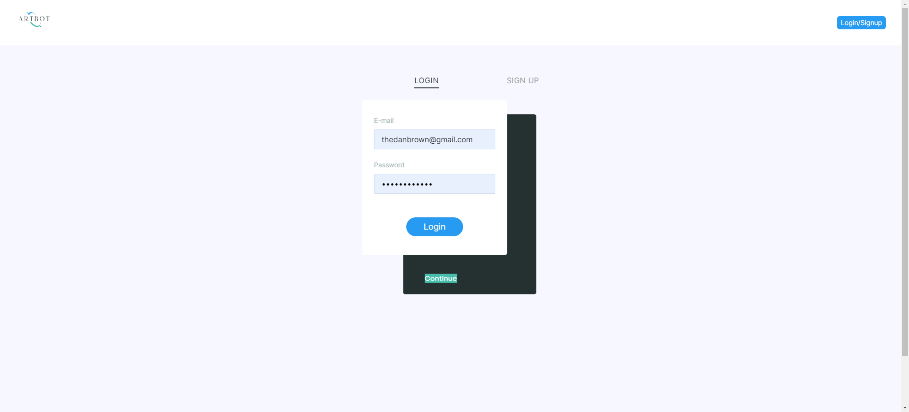
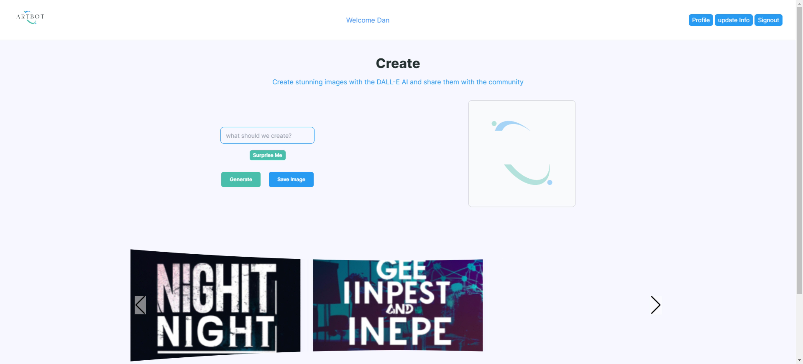

# artbot-ai
Art generator for small businesses running campaigns / advertisements

## Table of Contents
1. [Description](#Description)
2. [User-Stories](#User-Stories)
3. [Acceptance-Criteria](#Acceptance-Criteria)
4. [Mockup](#Mockup)
5. [Deployed Application](#Deployed-Application)
6. [Questions](#Questions)

# Description
***
###### [Back to Table of Contents](#Table-of-Contents)
The purpose of this group project was to develop a MERN application that showcases the skills that we have developed throughout the bootcamp. Specifically skills surrounding MongoDB, REACT, JWT, and GraphQl. The following is the elevator pitch: Are you tired of scrolling through endless pages of search results to find the perfect image? Look no further than Artbot AI! Our AI-powered image generator allows you to search for anything and generates unique, high-quality images for you to use. Plus, with our secure login and signup feature, you can rest assured that your information and images are safe. And the best part? You can save your favorite images to use again and again. Say goodbye to boring, generic images and hello to ArtBot AI!

## User Stories
***
###### [Back to Table of Contents](#Table-of-Contents)
```
AS A small business owner
I WANT a website to help me find the best images to help me market my products and business
SO THAT my business can get the most traffic
```

## Acceptance Criteria
***
###### [Back to Table of Contents](#Table-of-Contents)
```
GIVEN an image marketing website
WHEN I land on the marketing page I see samples of the images that can be generated and information about the website
THEN I am able to click a button to either login or sign up to use the AI image generator
WHEN I login or sign up to the application
THEN I am able to begin using the Artbot-AI generator
WHEN I view the image generator
THEN I am able to either enter text for the image I want to be generated or click surprise me to have Artbot AI suggest a prompt
WHEN I view the Artbot generator
THEN I am able to also view images that I have previously generated and purchased


FUTURE DEVELOPMENT:
- Updating user information
- Purchasing images using stripe integration
```

## Mockup
***
###### [Back to Table of Contents](#Table-of-Contents)
The following images show the web application's appearance:





## Deployed Application
***
###### [Back to Table of Contents](#Table-of-Contents)
https://artbotai.herokuapp.com/


## Credits
***
###### [Back to Table of Contents](#Table-of-Contents)
GT Bootcamp Tutors and TAs
JavaScript Mastery for inspiration (https://www.youtube.com/watch?v=EyIvuigqDoA)


## License
***
###### [Back to Table of Contents](#Table-of-Contents)
MIT

# Contributors
***
###### [Back to Table of Contents](#Table-of-Contents)
Review our GitHub Repos:

https://github.com/Thedanbrown
thedanbrown@gmail.com

https://github.com/khanhpbui
pkkhanhbui@gmail.com

https://github.com/TylerKandarian 
tyler.kand2@gmail.com

https://github.com/jae-as
janaee.as.wallace@gmail.com

